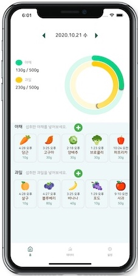
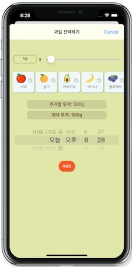
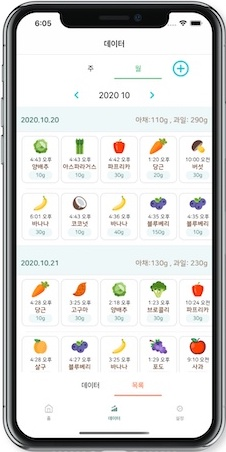
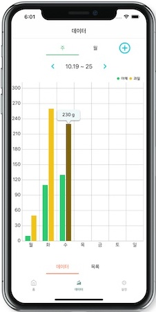
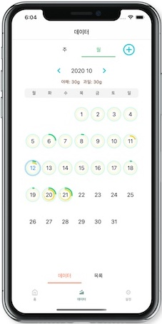
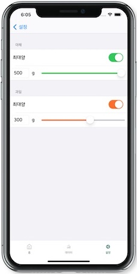
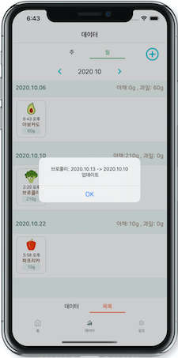

# VFCounterApp 🥦🥬🍓🍉

 

 
\
하루에 섭취한 야채, 과일의 양을 기록할 수 있는 앱입니다.

## 기능
- 날짜를 설정하여, 섭취한 야채나 과일을 선택하고 무게를 추가할 수 있습니다.
- 지난 기록은 메인화면의 화살표를 터치하면 과거와 현재를 이동할 수 있습니다.
- 메인 화면의 날짜를 누르면 달력 팝업이 나옵니다.
- 저장된 데이터는 주간, 월간으로 나누어 그래프나 달력으로 불 수 있습니다.
- 잘못 입력 했나요?  아이템을 길게 누르면 수정/삭제를 할 수 있습니다.
- 권장량 500g을 안지켜도 됩니다. 원하는 양을 설정창에서 설정할 수 있습니다.

## 스크린샷
        

## 사용한 라이브러리
**Swift Package**\
[SnapKit](http://snapkit.io/)\
[Charts](https://github.com/danielgindi/Charts)\
[CoreStore](https://github.com/JohnEstropia/CoreStore)

**Modify Opensource**\
[Calendar by Fastis](https://github.com/retailcrm/Fastis)

**CocoaPods**\
[MKRingProgressView](https://github.com/maxkonovalov/MKRingProgressView)\
[SwiftLint](https://github.com/realm/SwiftLint)

## License
VFCounter App은  **MIT License** 등록 되어있습니다.  
자세한 [라이센스](https://github.com/oddukgi/VFCounterApp/blob/master/LICENSE)는 확인해주세요.
